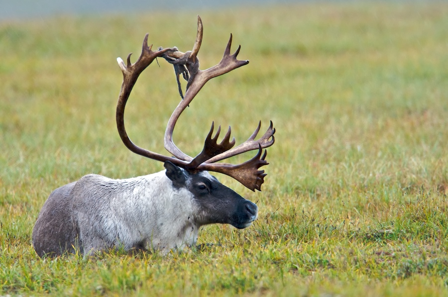

```{r setup, include=FALSE}
knitr::opts_chunk$set(echo = FALSE, message = FALSE, error = FALSE)
```

# Heading 1

Text can be **bold** or *italics* and can have [links](https://en.wikipedia.org/wiki/Porcupine_caribou) embedded.

## Heading level 2

You can put in images from the web with a url:


Or put in local images using a relative path:



### Heading level 3

You can have a bulleted list:

- One
- Two
    - a
    - b
- Three

Or a numbered list:

1. One
2. Two
    1. a
    2. b
3. Three

# HTML Code

For certain things you'll need to use HTML. For example, audio could be put in the page by using soundcloud embed code:

<iframe width="100%" height="300" scrolling="no" frameborder="no" src="https://w.soundcloud.com/player/?url=https%3A//api.soundcloud.com/tracks/206385711&amp;color=%23ff5500&amp;auto_play=false&amp;hide_related=false&amp;show_comments=true&amp;show_user=true&amp;show_reposts=false&amp;show_teaser=true&amp;visual=true"></iframe>

Or, if the files are local, with:

<audio src="media/screaming-piha.mp3" controls preload></audio>

You can also use HTML to center an image, Markdown will align them left usually.


# R Code

With R code you could embed a leaflet map. Tons of leaflet help and examples [here](https://rstudio.github.io/leaflet/). See the map tiles you can use [here](http://leaflet-extras.github.io/leaflet-providers/preview/index.html).

```{r}
library(sf)
library(leaflet)
yukon_shapefile <- read_sf("media/yukon.shp")
leaflet(width = 800, height = 800) %>% 
  addProviderTiles("Esri.NatGeoWorldMap") %>% 
  # polygon from shapefile
  addPolygons(data = yukon_shapefile, color = "#F38630", popup = "Some popup text") %>% 
  # add point directly
   addMarkers(lng = -123.12, lat = 49.24, popup = "Vancover")  
```


